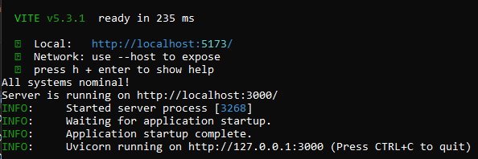

# Virtual Keyboard ⌨

## What is it? 🤔

Just a simple virtual keyboard which imitates your keypresses...that's all

NOTE: This only works for desktops/laptops. I don't know how this will work for mobiles, and I have no plans to implement as such.

## Contributing 👋

~~Not accepting any PRs right now, might open them later!~~
Accepting PRs! Will update guidelines soon

## Installation ⚙
### Check for dependencies:

1) Make sure you have **git** installed and added on PATH.
   
   - You can check by opening a terminal(CMD/Powershell/MinTTY etc) and typing in it:
     ```bash
     git -v
     ```
   - If it shows you the version(eg. git version 2.45.1.windows.1), you are good to go!
2) Make sure you have **Node and NPM** installed and added on PATH.
   
   - You can check by opening a terminal(CMD/Powershell/MinTTY etc) and typing in it:
     ```bash
     node -v
     ```
     AND
     ```bash
     npm -v
     ```
   - If these work, you are good to go!
3) Make sure you have **Python and pip** installed and added on PATH.
   
   - You can check by opening a terminal(CMD/Powershell/MinTTY etc) and typing in it:
      ```bash
      python --version
      ```
      AND
      ```bash
      pip --version
      ```
   - If these work, and you don't get some scary red text, you are good to go!
### Resolving dependencies:

If all the 5 commands worked, please skip this part.
Otherwise, here are links to download the necessary packages:
1) Python: [](https://www.python.org/downloads/)
2) Node: [](https://nodejs.org/en/download/package-manager/current)
3) Git: [](https://git-scm.com/downloads)
<br>
Follow the steps, and you should be good to go...

### Cloning into the repository

```bash
git clone https://github.com/ritesh-debnath-12/virtual-keyboard
```

### Setting up the virtual-keyboard local server

#### File explorer method:
  - Navigate to virtual-keyboard folder/directory
  - Double click on **install.exe** and let it complete..
  - Double click on **runner.exe** and let it complete...

#### Terminal method:
  - Change your terminal directory to virtual-keyboard
    ```bash
    cd virtual-keyboard
    ```
  - (FOR WINDOWS)Run install.exe and runner.exe
    ```bash
    install.exe & runner.exe
    ```
  - (FOR LINUX)Run install.sh and runner.sh
    ```bash
    source install.sh & source runner.sh
    ```
It should look like this: <br>


Whichever method you chose, server should be running...*Press O in the terminal to pop open a browser window* or *navigate yourself*

## After Installation...😅

If your keyboard is all over the place, here are two ways to fix it:
1) Press **Ctrl and then scroll down**.
                 OR
2) Press **Ctrl and then press - on your numpad**.

I apologize for the problems, but as of now, I have no idea how to fix this... 😭

## TO-DO 📃

- Readonly text area which will contain the keypresses)✅
- Special keys(Space, Backspace, Tab, Caps Lock etc) ✅
- Send a text file to you regarding what you have written. ✅
- Add more themes (WIP. ETA: Unknown)
- Add a central webpage to access themes (WIP. ETA: Unknown) 
